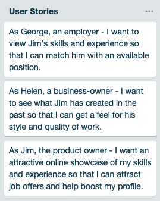

# Jim Farrugia's Portfolio v1.1.0

#### Links: [Live Website](https://jimfarrugia.github.io) | [Github Repository](https://github.com/jimfarrugia/jimfarrugia.github.io)

## Description

### Purpose

The purpose of this website is to present my previous work and convey my level of talent and skill to prospective employers as well as anyone else who may be interested.

### Features / Functionality

The website features a relatively minimal, clean, modern design with a motto of "content first".

Some stand-out features of the website:

- Collapsing responsive layout.
- Cards with toggles for modal windows.
- Slide-out sidebar navigation.
- jQuery/CSS animations.

### Sitemap

See also: XML Sitemap ([**sitemap.xml**](./docs/sitemap.xml))

### Screenshots

Homepage on Small Screen:

About Page on Small Screen:

History Page on Small Screen:

Slide-Out Sidebar Navigation:

Homepage Header on Larger Screen:

Homepage Main-Content on Larger Screen:

Homepage About & Footer on Larger Screen:

About Page on Larger Screen:

History Page on Larger Screen:

### Tech Stack & Tools

- **Project Managoement:** Trello, Google Drive, Google Docs
- **Graphics:** Pixlr Online Photo Editor
- **Fonts:** Roboto, Roboto Mono & Material Icons (all Google fonts)
- **Source Control:** Git / Github
- **IDE / Editor:** VS Code
- **Front-End Stack:** HTML5, CSS3, SASS (CSS Preprocessor), Javascript
- **Frameworks:** Materialize (CSS Framework)
- **Libraries:** jQuery (Javascript Library)
- **Deployment Platform:** Github Pages

## Design Process

### Planning

Having limited time, one of the first things I did was write a [**Project Plan**](./docs/portfolio-project-plan.pdf) and a [**Timeline**](./docs/portfolio-project-timeline.pdf) for the project.

I scoped out requirements, core features and stretch goals. Then I broke up requirements and goals into tasks and put those tasks on a Trello board.

I used different colours to give tasks categories such "planning", "feature" and "documentation". I also used Trello to enter and keep track of due-dates for individual tasks so I wouldn't need to refer to the timeline document as much as I was in my previous project.

### User Stories

### Colour Palette & Moodboard

The primary blue and yellow colours of the website were inherited from version 1.0 however, I used Google's materical design colour palette tool to generate additional swatches as well as test for accessibility / legibility.

[Colour Palette Export - Codepen](https://codepen.io/jimfarrugia/pen/XGxbML) (Examples of buttons and layouts).

I created a moodboard with some various elements that I wanted to keep from the original design, and some various references to the desired 'look and feel' of the design.

### Wireframes

I drew wireframes for the layout on small and large screens. I also made some notes about things I wanted to include in the design. These came in handy from start to finish.

Small Screen Wireframes:

Larger Screen Wireframes:

### Logo

I spent quite a while and went through a fair few iterations to come up with this logo last year.

I like the look and feel of the logo. I designed it to synergize with the material design pattern I'd been planning to use in my portfolio. The logo was also designed with the goal of looking good in a wide variety of colours and on a wide variety of background colours.

### Usability Considerations

- Text should be legible throughout the entire website.
  - Tested legibility of text on colours in website colour palette.
  - Used SASS function to display light text colour on dark backgrounds and dark text colour on light backgrounds.
- Sidebar / Navbar toggle should be obvious and intuitive to the user.
  - Used bright secondary colour (yellow) to imply navigation throughout the website. Yellow is used to denote buttons and links, including the sidebar toggle button.
  - Sidebar toggle button position is fixed and always accessible.

---

##### Assessment Q&A

Include short answers to the following questions:

1. Describe key events in the development of the internet from the 1980s to today (max. 150 words):

In 1983, TCP/IP became the standard for internet protocol and DNS was introduced to automatically assign IP addresses to domain names.

In 1990, A hypertext system is created by Tim Berners-Lee while working for CERN.

On August 6th, 1991 CERN released the World Wide Web publicly.

In 1994, Pizza Hut created the first internet ordering system.

1996 saw the release of the first mobile phone with internet access.

In 1999, wireless technology 802.11b (Wi-Fi) is standardized.

The web quickly grew throughout the 2000s with more users getting online each day. By 2006, there were an estimated 92 million websites online and Google’s index reached 1 Trillion URLs in 2008.

Today, 4 billion out of the 7 billion people on Earth are online and 5000 domain names are registered every hour. The internet and the web have grown immensely over time and show no signs of slowing down.

2. Define and describes the relationship between fundamental aspects of the internet such as: domains, web servers, DNS, and web browsers (max. 150 words):

3. Reflect on one aspect of the development of internet technologies and how it hascontributed to the world today (max. 150 words):
